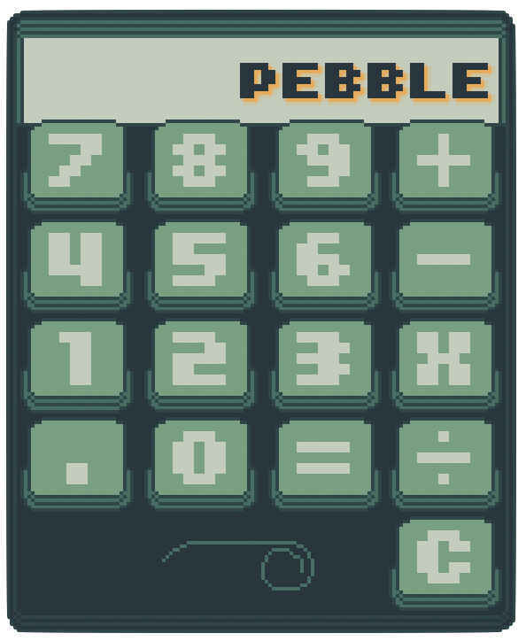

# 🪨 Pebble Calculator

A tiny, whimsical calculator built in Godot with pixel art charm.  
Built from scratch — code, art, and animations — as a personal project to explore Godot and dip into pixel art creation.

---

## 🎮 Features

- ✴️ **Arcade-style button presses** with tactile feedback feel
- 🌪 **Whimsical spiral animation** at the base of the interface
- 🎨 **Custom pixel art UI** using a green-blue palette
- ➗ **Basic arithmetic**: addition, subtraction, multiplication, division
- 🔢 **Decimal support**
- 🧼 **Clear input** functionality

---

## 🧰 Built With

- **Engine**: [Godot](https://godotengine.org/) 4.x
- **Nodes used**: `Area2D`, `TileMapLayer`, `Label`, `Camera2D`, `AnimatedSprite2D`, `AudioStreamPlayer2D`
- **Godot Concepts**: Signals (`mouse_entered`, `mouse_exited`), scene tree, input handling, sound playback
- **Visual Design**: Hand-drawn pixel art, custom animation, color palette

---

## 🚀 Demo

[👉 Try the calculator](https://blovato.github.io/PebbleCalculator/)

---

## 🛠 Proposed Improvements

- Add memory functions (M+, MR, MC)
- Add keyboard input support
- Responsive layout for different screen sizes
- Polish spiral animation timing and texture
- Add encouraging copy during use (ex. "Wow look at you go!")

---

## 🌀 Why “Pebble”?

Just like a pebble is small, grounded, and complete in itself, this app was meant to be a compact and satisfying first creation — fun to build, pleasing to use.

---

## ✨ Credits

Created with 💚 by Brenten Lovato
